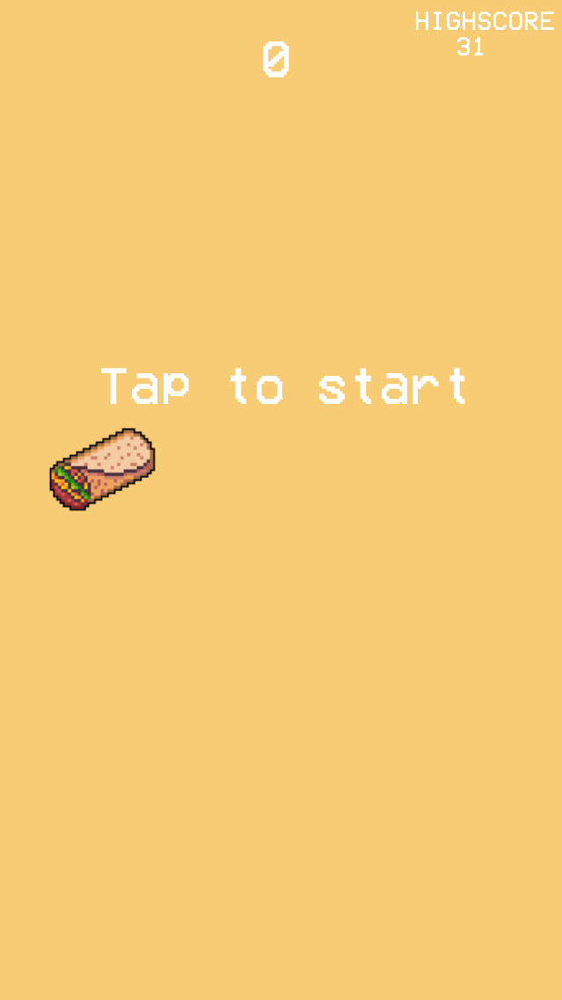
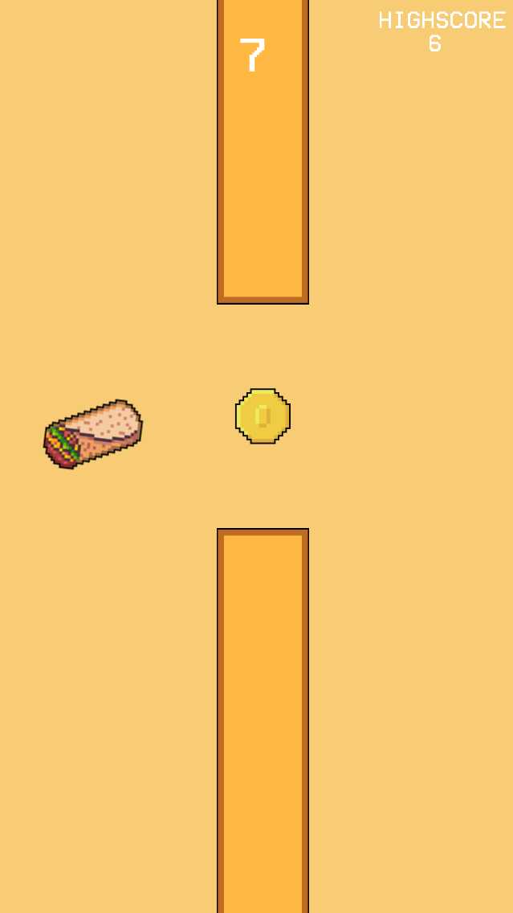
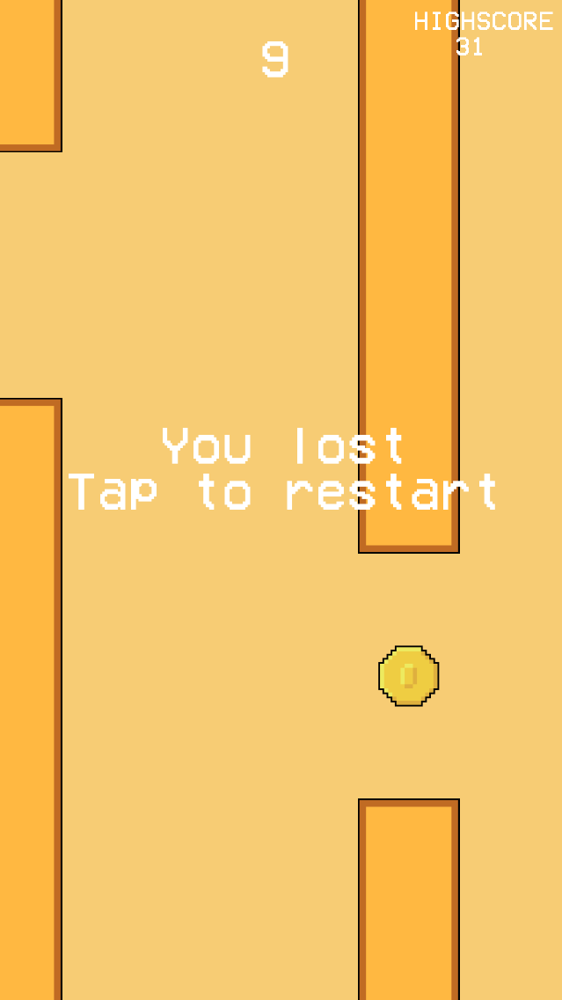

# Flappy Burrito

  
  
  

# Description

Flappy Burrito is a simple mobile game I made while learning Defold. I made the sprites myself and since I'm not an artist they are quite bad.

# How to run

Since this is a Defold project just open it in Defold and run it from there.
